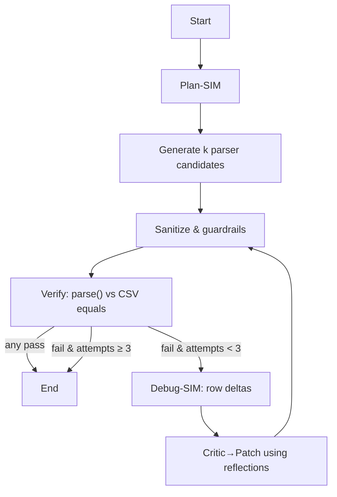

# Bank-Statement Parser Agent - Incorporated recent reseach proven methods to enhance the agent.

A small, **simulation-driven codegen agent** that writes a bank-specific PDF parser and verifies it **strictly** against a gold CSV using `pandas.DataFrame.equals`.  
It follows a tight loop: **plan → generate candidates → run tests → self-fix (≤3)**. 🔁

**Loop overview**
- **Plan-SIM:** sample a few PDF lines to infer date patterns, header filters, and amount-cleaning rules.  
- **Generate (best-of-k):** produce multiple full parser modules.  
- **Score:** rank candidates with a strict verifier plus a simple heuristic (schema match, row count proximity, early cell overlap).  
- **Test:** run `parse(pdf)` and compare to the CSV with strict equality.  
- **Debug-SIM:** if all fail, compute row-level deltas (got vs expected).  
- **Critic→Patch:** feed those deltas into a minimal-change repair prompt, write the patch, and retest.  
- **Reflection:** persist short “rules learned from failures” (e.g., drop per-page headers; `DD-MM-YYYY`; blanks→NaN) and inject them into later prompts.  
- **Cap:** stop after ≤3 self-fix attempts or on first pass.
- **Safefy** I also added a safety layer so that network/shell imports are **banned** in generated code.

**Artifacts:** plan, prompts, scores, deltas, and reflections are saved under `trace/`.


[We Dont Pass Any Code as the example for prasing - whole process is automated]

---
## Quick start (install)
```bash
# 1) Python env (recommended)
python -m venv .venv && source .venv/bin/activate

# 2) Install deps
pip install -r requirements.txt

# 3) Choose an LLM provider (pick ONE)
export LLM_PROVIDER=gemini   && export GOOGLE_API_KEY=...   # or
# export LLM_PROVIDER=groq   && export GROQ_API_KEY=...     # or
# export LLM_PROVIDER=openai && export OPENAI_API_KEY=...
````

> This project intentionally uses a **lightweight custom loop** (no LangGraph). The assignment allowed “LangGraph **or** any lightweight SDK”; we opted for clarity, speed, and simple logs.

---

## Research inspirations (what we borrowed & how)

We adapted **recent agent/code-generation research** into a pragmatic loop:

- **CODESIM (2025)** — *Multi-Agent Code Generation and Problem Solving through Simulation-Driven Planning and Debugging.*  
  **We took:** simulation-driven planning, multi-candidate generation + scoring, and debugging via test feedback.  
  **Our spin:** a **single-agent “CodeSIM-lite”** loop — Plan-SIM (sample the PDF), **best-of-k** modules, strict oracle test, then **critic→patch** (≤3).  
  [[arXiv]](https://arxiv.org/abs/2502.05664)

- **Self-Consistency / Best-of-N** (Wang et al., 2022) — sample multiple solutions and keep the best.  
  **In our system:** we generate **k parser modules** and score them with a strict verifier.  
  [[arXiv]](https://arxiv.org/abs/2203.11171)

- **Self-Refine** (Madaan et al., 2023) & **Reflexion** (Shinn et al., 2023/2024) — iterative self-feedback/memory.  
  **In our system:** we persist short **reflection rules** from failures (e.g., drop per-page headers; `DD-MM-YYYY`; blanks→NaN) and feed them into later prompts.  
  [[Self-Refine arXiv]](https://arxiv.org/abs/2303.17651) • [[Reflexion arXiv]](https://arxiv.org/abs/2303.11366)

- **TDD-style repair** — failing tests yield a **delta report** that conditions the **critic→patch** prompt; repair attempts are capped to keep runtime predictable.

**Why this mix?** You get the reliability of research-backed patterns (simulate → verify → repair) without heavy orchestration — fast runs, clear logs, and deterministic checks.```
::contentReference[oaicite:0]{index=0}


---

### Architecture

The agent runs a tight simulation-driven loop: **Plan-SIM** first samples a few lines from the input PDF to infer date patterns, header filters, and amount-cleaning rules. It then **generates k complete parser modules** and **verifies** each by running `parse(pdf)` and comparing against the gold CSV with `pandas.DataFrame.equals` (strict schema and values). If none pass, it computes a **row-level delta report**, triggers a **critic → patch** step guided by short **reflection rules**, writes the patch, and **retests**. This closed loop repeats up to **≤3** attempts or until tests pass.



---

## Run in 5 steps

1. **Prepare data**
   Place your gold CSV at `data/<bank>/result.csv`. Your statement PDF can be anywhere (you pass its path on CLI).

2. **Select provider**
   Set `LLM_PROVIDER` and the corresponding API key (see *Quick start*).

3. **Generate & verify**
   Correct run on dataset:
   ```bash
   python agent.py --target icici --pdf "data/icici/icici sample.pdf"  --csv data/icici/result.csv --best_of 3 --p 1 --d 2
   ```
   Test on wrong PDF (to verify how the agent behaves when random input is given)
   ```bash
   python agent.py --target wrong --pdf "data/wrong/wrong sample.pdf"  --csv data/wrong/result.csv --best_of 3 --p 1 --d 2
   ```
4. **Inspect artifacts**

   * `custom_parser/<bank>_parser.py` — the selected parser
   * `trace/` — prompts, plan, candidate scores, deltas, reflections (These are generated file which enhance our Agent)

5. **Run tests (T4)**

   ```bash
   pytest -q #default icici
   ```

    ```bash
    pytest -q --bank icici --pdf-name "wrong_ex.pdf"
    ```

   The key assert is **strict**: `got.equals(exp)`.

---

## What the agent does (highlights)

* **Plan-SIM:** sample a few lines from the PDF to derive **date regexes**, **header filters**, and **amount cleaning** hints.
* **Candidate generation:** build **k** complete Python modules. A sanitizer enforces **safe imports**, the required **`parse(pdf_path)`** signature, and guards against fragile `.str` on numeric Series.
* **Strict verifier:** run `parse(pdf)` and check **exact schema & values** with `DataFrame.equals` (indices reset).
* **Debug-SIM & self-fix:** compute row-level **deltas**, generate a minimal **patch**, write it, and **re-verify** (≤3).
* **Reflections:** store short failure rules and inject them into subsequent prompts.

---

## Safety & guardrails (what protects the run)

- **No network/shell code:** a sanitizer comments out banned imports/APIs (`subprocess`, `os.system`, `requests`, `urllib`, `httpx`, `socket`, `popen`).
- **Signature & imports enforced:** strips code fences, injects `import pandas as pd`, `import pdfplumber`, `import re`, and guarantees `def parse(pdf_path: str) -> DataFrame` with the **exact** schema.
- **Type-safe string ops:** auto-rewrites fragile `.str` calls on numeric series to `.astype(str).str...`, preventing runtime `AttributeError`.
- **Prompt-level guardrails:** the generation/critic prompts **explicitly forbid** network/shell libraries and require `to_numeric(..., errors="coerce")`, `DD-MM-YYYY`, and index reset.
- **Oracle verification, not heuristics:** acceptance only on **strict** `pandas.DataFrame.equals` (columns, types, values, index).
- **Traceability:** all artifacts are logged to `trace/` (plan, candidate scores, deltas, reflections) for audit/debugging.

---

## Project layout

```
.
├─ agent.py                      # main agent loop (lightweight SDK)
├─ custom_parser/
│  └─ <bank>_parser.py          # generated parser module
├─ data/<bank>/
│  ├─ result.csv                # gold output (oracle)
│  └─ <your_statement>.pdf      # your input PDF
├─ tests/test_bank_parser.py     # T4: strict equals test
└─ trace/                        # plan, prompts, deltas, scores, reflections
```
### Trace folder — quick cheat-sheet

- `plan.json` — Drafted plan config (date regexes, header filters, amount rules).
- `sim_plan.txt` — Plan-SIM results on a few sampled PDF lines (feasibility check).
- `candidate_scores.json` — Heuristic scores for each generated parser candidate.
- `candidate_selected.txt` — Filename of the winning candidate.
- `final_parser.py` — Snapshot of the final selected parser module.
- `observe.json` — Test summary after each run (pass/fail, shapes, columns_equal).
- `sim_debug.txt` — Row-level deltas (got vs expected) used for critic→patch.
- `reflections.jsonl` — Short “rules learned from failures” carried to next attempts.
- `fatal_error.txt` — Full exception trace if the run aborts.

**Prompts:** not persisted by default (to keep traces small). If you want them, add
`twrite("prompt_gen.txt", prompt)` and `twrite("prompt_patch.txt", prompt)` where prompts are built.

---

## CLI flags

* `--target <bank>`: label used in filenames (e.g., `icici`, `sbi`)
* `--pdf <path>`: input statement PDF path
* `--csv <path>`: gold CSV path
* `--best_of <k>`: candidates to sample (default 3)
* `--p`: plan retries (default 1)
* `--d`: self-fix attempts (default 2, **≤3** by design)
* `--trace_all`: dump extra traces even on success

---

## Testing (T4 compliance)

The test asserts:

* **Column names/order** match
* **Index** is a `RangeIndex`
* `got.equals(exp)` is **True**

This exactly matches: **“T4 Test — assert parse() output equals the provided CSV via DataFrame.equals.”**

---

## Implementation notes

* **Numbers:** commas stripped; parentheses → negatives; blanks → **NaN** (`to_numeric(..., errors="coerce")`).
* **Dates:** output as **`DD-MM-YYYY`** strings (accepts `/` or `-` in input).
* **Headers/footers:** per-page duplicates are removed.
* **Safety:** network/shell imports are **banned** in generated code.

---

## References (concise)

* **CODESIM (2024)** — *Multi-Agent Code Generation and Problem Solving through Simulation-Driven Planning and Debugging.*
* **Self-Consistency** (*Wang et al., 2022*) — best-of-N sampling.
* **Self-Refine** (*Madaan et al., 2023*) — iterative self-improvement from feedback.
* **Reflexion** (*Shinn et al., 2023/2024*) — memories of failures guiding future attempts.
